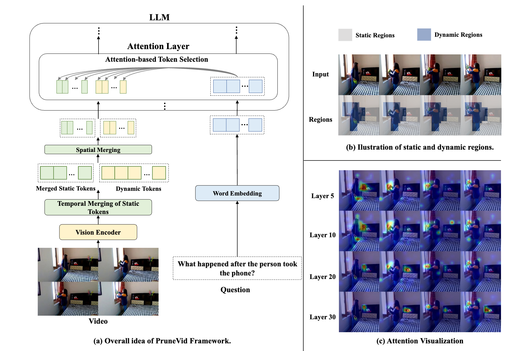

# PruneVid
The official repository for paper "PruneVid: Visual Token Pruning for Efficient Video Large Language Models".

Xiaohu Huang, Hao Zhou, Kai Han

[`Paper`](https://arxiv.org/abs/2412.16117v1)

# Introduction


We present PruneVid, a training-free visual token pruning method that enhances efficiency in multi-modal video understanding. By merging spatial-temporal tokens to reduce video redundancy and leveraging attention mechanisms within LLMs to retain only the visual tokens relevant to questions, PruneVid ensures high performance while reducing computational overhead.

# Todo:
- [x] Code release of PruneVid with PLLaVA.
- [ ] Code release of PruneVid with LLaVA-OneVision.
- [ ] Code release of PruneVid with ST-LLM.

# License

PruneVid is released under the [`CC BY-NC-SA 4.0 license`](https://creativecommons.org/licenses/by-nc-sa/4.0/).

# Performance

We conduct experiments on three video LLMs (PLLaVA, ST-LLM, and LLaVA-OneVision) under for benchmarks: MVBench, VideoMME, Egoschema, and VideoChatgpt-Bench (VCG-Bench).

| Method                          | Retained Ratio | FLOPs (×) | MVBench | VideoMME | EgoSchema Subset / Fullset | TU   | CU   | CO   | DO   | CI   | Avg  |
|---------------------------------|----------------|-----------|---------|----------|---------------------------|------|------|------|------|------|------|
| PLLaVA                          | 100.0%         | 1.00×     | 46.6    | 44.4     | 47.8 / 42.6                | 2.33 | 3.62 | 2.93 | 2.86 | 3.21 | 2.99 |
| PLLaVA w/ FastV                 | 30.0%          | 0.33×     | 46.1    | 43.6     | 46.2 / 41.0                | 2.38 | 3.49 | 2.89 | 2.76 | 3.14 | 2.93 |
| PLLaVA w/ Prumerge              | 55.7%          | 0.53×     | 45.6    | 43.8     | 45.2 / 40.4                | 2.34 | 3.52 | 2.90 | 2.76 | 3.15 | 2.93 |
| PLLaVA w/ Look-M                | 20.0%          | 1.00×     | 46.6    | 44.3     | 47.0 / 42.3                | 2.28 | 3.41 | 2.75 | 2.65 | 3.00 | 2.82 |
| **PLLaVA w/ Ours**              | **16.2%**      | **0.23×** | **47.6**| **45.3** | **49.0 / 42.6**            | **2.44** | **3.51** | **2.99** | **2.78** | **3.20** | **2.98** |
|                                 |                |           |         |          |                           |      |      |      |      |      |      |
| ST-LLM                          | 100.0%         | 1.00×     | 54.9    | 42.0     | 56.2 / 45.6                | 2.46 | 3.46 | 2.66 | 2.63 | 3.08 | 2.86 |
| ST-LLM w/ FastV                 | 30.0%          | 0.37×     | 42.9    | 34.5     | 48.0 / 38.5                | 2.01 | 2.23 | 1.55 | 1.94 | 1.69 | 1.88 |
| ST-LLM w/ Look-M                | 20.0%          | 1.00×     | 54.0    | 40.6     | 54.0 / 44.5                | 2.35 | 3.41 | 2.60 | 2.51 | 3.01 | 2.78 |
| **ST-LLM w/ Ours**              | **15.1%**      | **0.26×** | **54.3**| **41.4** | **54.6 / 44.7**            | **2.40** | **3.43** | **2.63** | **2.60** | **3.04** | **2.82** |
|                                 |                |           |         |          |                           |      |      |      |      |      |      |
| LLaVA-OneVision                 | 100.0%         | 1.00×     | 58.0    | 58.2     | 62.0 / 60.0                | 2.75 | 3.70 | 3.39 | 2.97 | 3.50 | 3.26 |
| LLaVA-OneVision w/ FastV        | 30.0%          | 0.30×     | 57.2    | 57.6     | 62.6 / 60.0                | 2.65 | 3.61 | 3.28 | 2.85 | 3.39 | 3.16 |
| LLaVA-OneVision w/ Prumerge     | 55.2%          | 0.49×     | 52.9    | 56.7     | 62.2 / 60.0                | 2.72 | 3.64 | 3.32 | 2.94 | 3.44 | 3.21 |
| LLaVA-OneVision w/ Look-M       | 20.0%          | 1.00×     | 57.0    | 58.0     | 62.0 / **59.8**            | 2.71 | 3.70 | 3.29 | 2.89 | 3.44 | 3.21 |
| **LLaVA-OneVision w/ Ours**     | **17.0%**      | **0.20×** | **57.5**| **58.6** | **62.6 / 59.5**            | **2.73** | **3.72** | **3.28** | **2.94** | **3.51** | **3.24** |

# Data Preparation

All four used benchmarks can be downloaded from huggingface website: [`MVBench`](https://huggingface.co/datasets/OpenGVLab/MVBench), [`VideoMME`](https://huggingface.co/datasets/lmms-lab/Video-MME), [`Egoschema`](https://huggingface.co/datasets/lmms-lab/egoschema), and [`VideoChatGPT-Bench`](https://huggingface.co/datasets/lmms-lab/VideoChatGPT).

After downloading the datasets, please put them into the `DATAS` folder and sort out the source videos and annotations in the following formats:
```
DATAS/
├── ego_schema/
│   ├── json/
│   └── videos/
├── MVBench/
│   ├── json/
│   └── video/
├── VCGBench/
│   ├── Videos/
│   ├── Zero_Shot_QA/
└── Video-MME/
    ├── data/
    └── json/
```

# Pretrained Model

The pretrained model can be found in their respective repositories: [`PLLaVA`](https://github.com/magic-research/PLLaVA?tab=readme-ov-file), [`ST-LLM`](https://github.com/TencentARC/ST-LLM/tree/main/stllm), and [`LLaVA-OneVision`](https://huggingface.co/lmms-lab).

After downloading the models please put them into the MODELS folder:

```
MODELS/
├── pllava-7b/
```

# Environment Install

We follow the environment installation guideline of [`PLLaVA`](https://github.com/magic-research/PLLaVA?tab=readme-ov-file).

1. Above all, the following environment set up is for python 3.10. If you choose to use conda for environment setup, we recommend creating the virtual environment with:
```bash
conda create -n pllava python=3.10
```

1. Firstly, install [pytorch](https://pytorch.org/) from the official website. The code runs on torch 2.2.1, cu118 or cu122. Select the version that suits your drive version.

```
torch                       2.2.1+cu118
torchaudio                  2.2.1+cu118
torchvision                 0.17.1+cu118
```

If your driver version is higher than cu121, you could probably try installing with the following scripts:
```bash
pip install -r requirements.txt
```

Otherwise, you would need to install a torch for your server first, then install the other packages:
```bash
pip install -r requirements.torch.txt # decide your own requirements, (this is for cu11), or install torch directly following the official website.
pip install -r requirements.no_torch.txt # install the following
```

# Evaluation

As PruneVid is a training-free method, we can directly apply it on the pre-trained models.

The provided scripts for evaluating model performance is given in `scripts/eval.sh`. Below is the script for evaluating the performance on MVBench, where you can edit the hyper-parameters whatever you want. The default setting is used in our paper.

```
lora_alpha=14
selected_layers=(10)
alphas=(0.4)
taus=(0.8)
temporal_segment_ratios=(0.25)
cluster_ratios=(0.5)

for alpha in "${alphas[@]}"; do
  for selected_layer in "${selected_layers[@]}"; do
    for tau in "${taus[@]}"; do
      for temporal_segment_ratio in "${temporal_segment_ratios[@]}"; do
        for cluster_ratio in "${cluster_ratios[@]}"; do
          # 执行命令
          SAVE_DIR=test_results/pllava-7b-lora${lora_alpha}-threshold${tau}-layer${selected_layer}-alpha${alpha}-temporal-segment-ratio-${temporal_segment_ratio}-cluster-ratio-${cluster_ratio}
          mkdir -p "${SAVE_DIR}"
          conv_mode=eval_mvbench
          python -m tasks.eval.mvbench.pllava_eval_mvbench \
              --pretrained_model_name_or_path ${model_dir} \
              --save_path ${SAVE_DIR}/mvbench \
              --num_frames ${num_frames} \
              --use_lora \
              --lora_alpha ${lora_alpha} \
              --top_p 1.0 \
              --temperature 1.0 \
              --weight_dir ${weight_dir} \
              --pooling_shape 16-12-12 \
              --conv_mode ${conv_mode} \
              --selected_layer ${selected_layer} \
              --alpha ${alpha} \
              --tau ${tau} \
              --temporal_segment_ratio ${temporal_segment_ratio} \
              --cluster_ratio ${cluster_ratio}
        done
      done
    done
  done
done
```

As for Egoschema, which needs an external service to evaluate the model performance, we run the `evaluate_egoschema_result.py` for evaluation. Before executing the file, you should change the `root_dir` variable to your folder.
```
python evaluate_egoschema_result.py
```

# Acknowledgement

This repository is built upon [`PLLaVA`](https://github.com/magic-research/PLLaVA?tab=readme-ov-file), [`ST-LLM`](https://github.com/TencentARC/ST-LLM/tree/main/stllm), and [`LLaVA-OneVision`](https://huggingface.co/lmms-lab). Thanks for those well-organized codebases.

# Citation

```bibtex
@inproceedings{
  huang2024prunevid,
  title={PruneVid: Visual Token Pruning for Efficient Video Large Language Models},
  author={Xiaohu Huang and Hao Zhou and Kai Han},
  booktitle={Arxiv},
  year={2024}
}
```
